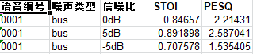
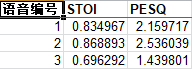
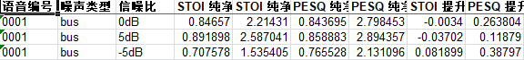

# Speech Enhancement Tools（setools）
  计算语音增强相关的评价指标(STOI, PESQ), 结果以excel表格形式保存


## Usage

安装 SETools 以及依赖

```shell
# 手动安装 PESQ Wrapper @vBaiCai
git clone https://github.com/vBaiCai/python-pesq.git
cd python-pesq
python setup.py install

# 安装 SETools
pip install SETools
```

使用方法：

```shell
Speech Enhancement Tools

optional arguments:
  -h, --help            
                        show this help message and exit
  --path_file PATH_FILE
                        包含两组语音文件路径的列表(.txt)
  --clean_dir CLEAN_DIR
                        纯净语音目录
  --noisy_dir NOISY_DIR
                        带噪语音目录
  --denoisy_dir DENOISY_DIR
                        降噪语音目录
  --output_path OUTPUT_PATH
                        评价指标存储的全路径,必须以拓展名 .xls 结尾
  --limit LIMIT         
                        被测试语音的数量.默认为0,表示不限制数量
  --offset OFFSET       
                        从某个索引位置开始计算评价指标,默认为0,表示从索引为 0 的语音开始计算
  --sr SR               
                        语音文件的采样率
```

可以接收的输入为`列表文件`或`具体的目录`。

值得注意的是，语音文件若以如下格式命名：
```text
num_noise_snr.wav   如：0001_bus_0dB.wav
```
结果的输出将更加全面具体：



否则输出如下：



接下来，我们首先介绍传入参数为列表文件的情况。

### 列表文件作为输入

#### 两列的列表文件

从左到右每列分别为`clean`和`noisy`的文件路径，以"，"隔开
```text
/home/.../clean/0001_bus_0dB.wav,/home/.../noisy/0001_bus_0dB.wav
/home/.../clean/0001_bus_5dB.wav, /home/.../noisy/0001_bus_5dB.wav
...
/home/.../clean/0001_cafe_0dB.wav, /home/.../noisy/0001_cafe_0dB.wav
```

当输入为两列的列表文件时，调用下面的命令：
```shell
$ setools --path_file data/two_columns_paths_file.txt

音频列表文件路径为：data/path_two.txt
Loading clean wavs: 100%|██████████| 3/3 [00:00<00:00, 1858.35it/s]
Loading noisy wavs: 100%|██████████| 3/3 [00:00<00:00, 2258.65it/s]
正在计算评价指标: 3it [00:00,  8.49it/s]
测试过程结束，结果将存储至 ./output.xls.
```

输出文件`output.xls`如下所示：


#### 三列的列表文件

从左到右每列分别为`clean`、`noisy`和`denoisy`的文件路径，以`"，"`隔开
```text
/home/.../clean/0001_bus_0dB.wav, /home/.../noisy/0001_bus_0dB.wav, /home/.../denoisy/0001_bus_0dB.wav
/home/.../clean/0001_bus_5dB.wav, /home/.../noisy/0001_bus_5dB.wav, /home/.../denoisy/0001_bus_5dB.wav
...
/home/.../clean/0001_cafe_0dB.wav, /home/.../noisy/0001_cafe_0dB.wav, /home/.../denoisy/0001_cafe_0dB.wav
```

当输入为三列时，调用下面的命令：
```shell
$ setools --path_file data/three_columns_paths_file.txt

音频列表文件路径为：data/path_three.txt
Loading clean wavs: 100%|██████████| 3/3 [00:00<00:00, 1856.98it/s]
Loading noisy wavs: 100%|██████████| 3/3 [00:00<00:00, 2344.06it/s]
Loading denoisy wavs: 100%|██████████| 3/3 [00:00<00:00, 2341.88it/s]
正在计算评价指标: 3it [00:00,  5.90it/s]
测试过程结束，结果将存储至 ./output.xls.
```

输出文件`output.xls`如下所示：



### 目录作为输入

#### 传入两个目录，即`clean`与`noisy`目录

调用下面的命令：
```shell
$ setools --clean_dir data/Clean 
          --noisy_dir /qqq/home/Speech_Enhancement_Tools-master/data/Noisy
        
纯净语音目录路径为：data/Clean
带噪语音目录路径为：data/Noisy
Loading clean wavs: 100%|██████████| 400/400 [00:00<00:00, 569.45it/s]
Loading noisy wavs: 100%|██████████| 400/400 [00:00<00:00, 666.96it/s]
正在计算评价指标: 400it [00:40,  9.76it/s]
测试过程结束，结果将存储至 ./output.xls.
```

输出文件`output.xls`如下所示：


#### 传入三个目录，即`clean`、`noisy`和`denoisy`目录

调用下面的命令：
```shell
$ setools --clean_dir data/Clean 
          --noisy_dir /qqq/home/Speech_Enhancement_Tools-master/data/Noisy
          --denoisy_dir data/DeNoisy

纯净语音目录路径为：data/Clean
带噪语音目录路径为：data/Noisy
降噪语音目录路径为：data/DeNoisy
Loading clean wavs: 100%|██████████| 400/400 [00:00<00:00, 2507.31it/s]
Loading noisy wavs: 100%|██████████| 400/400 [00:00<00:00, 2446.21it/s]
Loading denoisy wavs: 100%|██████████| 400/400 [00:01<00:00, 328.70it/s]
正在计算评价指标: 400it [01:15,  5.32it/s]
测试过程结束，结果将存储至 ./output.xls.
```

输出文件`output.xls`如下所示：


## ToDo

- [x] 计算语音增强相关的评价指标，计算结果会被保存为 Excel 表格。

## Licences

MIT